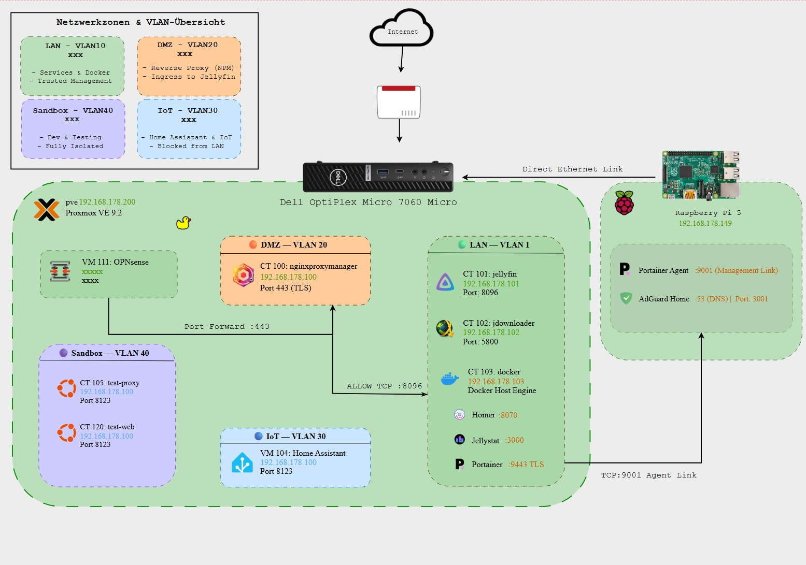

# 🏢 Home-Lab Infrastructure & Network Architecture

A documentation of my dedicated home-lab environment designed for practical implementation of **network segmentation (VLANs)**, **firewall policies**, **virtualization**, and **homelab services**.

---

## 🗺️ Network Topology

---

## ⚙️ Hardware Infrastructure

| Host / Node | Hardware Specs | OS / Hypervisor | Role / Workloads |
| :--- | :--- | :--- | :--- |
| **Primary Node** | Lenovo ThinkCentre M720q (Intel Core i5-8500T) | **Proxmox VE** | Virtualization Host, OPNsense Firewall/Routing, Docker VMs & LXC Containers |
| **Storage & Edge Node** | Raspberry Pi (24/7 low-power operation) | **Linux** | Lightweight Edge Services, File Storage & Network Shares (8 TB HDD) |
| **Networking** | Managed Switch / OPNsense Routing | — | IEEE 802.1Q VLAN Tagging & Inter-VLAN Routing |

---

## 🛡️ Network Segmentation & Security Zones

The network is segregated into isolated zones adhering to the principle of **least privilege**:

| VLAN ID | Subnet | Zone Name | Description & Policy |
| :--- | :--- | :--- | :--- |
| **VLAN 10** | `192.168.10.0/24` | **Management** | Dedicated out-of-band administration (Proxmox GUI, SSH, Switch Web UI). Fully isolated. |
| **VLAN 20** | `192.168.20.0/24` | **Trusted LAN** | Workstation & daily-use clients. Access to local services and WAN. |
| **VLAN 30** | `192.168.30.0/24` | **Server / Lab** | Hosting containerized services, storage shares, and lab environments. |
| **VLAN 40** | `192.168.40.0/24` | **DMZ / Testing** | Isolated environment for testing and vulnerability analysis. Zero lateral movement to LAN/Management. |
| **VLAN 50** | `192.168.50.0/24` | **IoT / Guest** | Smart-home & untrusted devices. Internet-only access with strict client isolation. |

---

## 🔒 Security Implementations

* **DNS-Layer Security:** Centralized DNS sinkhole via **AdGuard Home** providing network-wide telemetry and malicious domain filtering.
* **Firewalling & Traffic Control:** Strict default-deny rule base managed via **OPNsense**. Inter-VLAN communication is explicitly whitelisted per port and protocol.
* **Service Isolation:** Separation of concerns using Docker containers and lightweight LXCs to minimize attack surface.

---

## 📌 Roadmap & Future Enhancements

- [ ] Centralized log aggregation and monitoring (Grafana / Syslog)
- [ ] Implementation of a SIEM solution for threat detection (e.g., Wazuh)
- [ ] Automated configuration backups for Proxmox and firewall state
